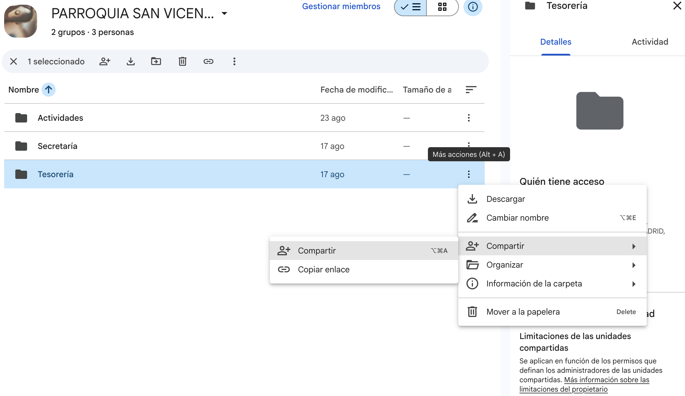
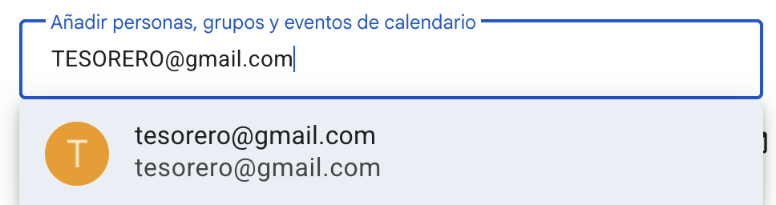

# Protección de Datos en Google Drive
En base al RGPD y la política de protección de datos de JMV, solamente las personas con un interés legítimo y autorización pueden acceder a datos sensibles. Estos comprenden, sin ser una lista exhaustiva:

- Listado de socios.
- Datos personales de los socios.
- Datos de los familiares de los socios.
- Deudas de los socios (por ejemplo, impagos de cuotas o inscripciones a actividades).

Es por ello que la unidad donde se alojan (la Unidad Compartida con el nombre de nuestro centro) no permite compartir accesos públicos. El perfil de centro debe autorizar **una a una** a las personas que vayan a acceder a estos datos y asegurarse de que esta lista de autorizados está actualizada. Esto implica retirar el acceso a quienes ya no tienen por qué tenerlo (ex-servicios de centro, etc.).

La carpeta “Mi Unidad”, sin embargo, no goza de esta protección, aunque se puede establecer manualmente para cada archivo/carpeta.  Los archivos y carpetas en esta unidad sí se puede compartir mediante enlaces de acceso universal, sin necesidad de autorizar uno a uno a quienes entran. Por ejemplo, podemos alojar aquí un .pdf con una circular para todas las familias del centro, imágenes promocionales, etc.

# Dar acceso a una carpeta de la Unidad Compartida

Para la gestión de una actividad, o de un servicio de centro, podemos dar acceso a toda una sección de la Unidad Compartida o de "Mi Unidad" a una persona con cuenta de Google.

Por ejemplo, para compartir la carpeta "Tesorería", simplemente tenemos que seleccionar la opción "Compartir" en el desplegable.

y compartirla con el tesorero de centro

Además, en esta pestaña, verás una lista actualizada de quien puede acceder a esta carpeta.

Debemos procurar mantener este listado actualizado.

> [!warning]
> Opción "Copiar enlace"
>
> El acceso se puede compartir también mediante enlace, pero las carpetas de la Unidad Compartida pedirán permiso a la cuenta de centro antes de concederlo.
>
> Debemos aceptar una a una a las personas que entren a la carpeta.
>
> En "Mi Unidad" esta opción se puede desactivar, pero solo debemos hacerlo con documentos realmente públicos: una circular para las familias, un cartel, etc.

 
