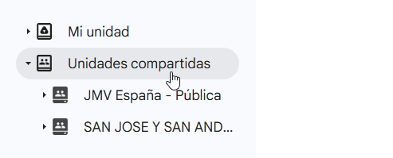
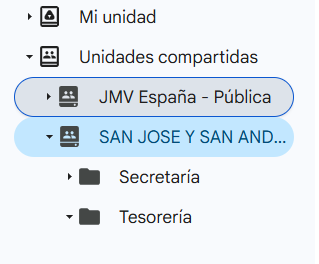

La novedad en esta cuenta serán las llamadas **Unidades compartidas**:

Como se puede ver, cada cuenta tendrá acceso a dos unidades compartidas diferentes:

1. JMV España - Pública: En esta unidad compartida tendrán acceso a la información pública de la asociación: logos, lema, calendario, proceso catecumenal, pasos de etapa…
2. Nombre de centro: Esta unidad compartida será la que se utilizará a partir de ahora para **guardar la información corporativa a la que el Secretariado Nacional debe tener acceso.** De hecho, si seleccionamos esa unidad compartida aparecerán 3 carpetas: 

**Carpeta de Secretaría**\
Aquí tendremos:

- Base de datos de centro: listado de socios con datos personales y enlace a la ficha de socio; componentes del equipo animador, equipo coordinador, etc.
- Carpeta FICHAS con las fichas de socio escaneadas.
- Carpeta MEMORIAS, donde guardaremos las memorias de actividades de cada año.
- Carpeta ACTAS, donde guardaremos las Actas de las Asambleas Ordinarias y Extraordinarias de nuestro centro.

En el futuro: la base de datos estará enlazada con la del ECN para evitar duplicidades.

**Carpeta de Tesorería**\
Aquí tendremos a:

- Nuestro libro de contabilidad, donde iremos escribiendo los asientos de todos nuestros movimientos de caja, tanto en efectivo como a través de la cuenta bancaria, y los asociaremos a una factura.
- Carpeta FACTURAS donde estarán las facturas. El nombre del archivo será el código del movimiento al que están asociadas en el libro de contabilidad.
- Carpeta MEMORIAS donde guardaremos las memorias económicas anuales.

En el futuro: el libro de contabilidad tendrá formato unificado en todos los centros y áreas para facilitar el acceso a la contabilidad nacional.

**Carpeta Actividades**\
Crearemos aquí una carpeta por cada actividad que hagamos que necesite manejo de datos protegidos (por ejemplo, una convivencia); otorgando acceso solamente a quien lo necesite.

La estructura interna de cada carpeta es libre, pero el título de cada carpeta seguirá este formato:

- YYYY\_MM\_DD\_Título, si es de un solo día.
- YYYY\_MM\_DI-DF\_Título si dura varios días (DI día de inicio, DF día final).
- YYYY\_MI\_DI-MF\_DF\_Título si tiene días de dos o más meses.

Los años los escribiremos con 4 dígitos (2026); los meses con dos dígitos (mayo es 05) y los días también.
