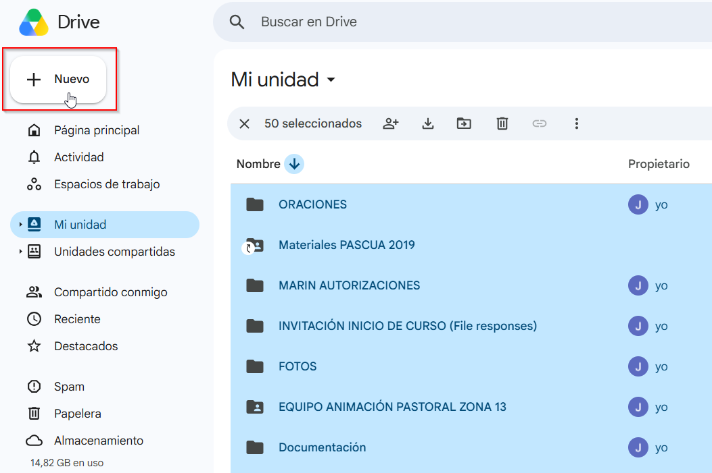

# Subir imágenes

Las capturas de pantalla ayudan muchísimo en las guías de procesos. Subirlas
tiene un poco más de trabajo que escribir texto, pero se hace una vez y se
entiende rápido.

!!! danger "Esta web es pública"

    Cualquiera en internet puede ver lo que subas aquí, y las imágenes quedan
    registradas en el historial aunque después se borren.

    **No subas nunca a esta web:**

    - Fotos en las que aparezcan **menores**.
    - Datos personales de socios: listados, DNI, teléfonos, direcciones,
      correos personales.
    - Documentos con datos bancarios o económicos identificables.

    En una captura de pantalla es fácil que se cuele un nombre o un correo en
    una esquina. **Míralas enteras antes de subirlas** y tapa lo que sobre. Si
    tienes cualquier duda, pregunta antes al grupo de webmasters.

## Dónde van las imágenes

Todas viven en la carpeta `docs/assets/img`, y dentro, en **una carpeta por
página**, con el mismo nombre que la página.

Por ejemplo, las imágenes de la página `migrar-nube.md` están en:

```
docs/assets/img/migrar-nube/01.png
docs/assets/img/migrar-nube/02.png
```

Se numeran por orden de aparición. Es una convención sencilla que evita acabar
con cincuenta archivos llamados `imagen.png` sin saber cuál es cuál.

## Paso a paso

### 1. Sube el archivo

En el repositorio, entra en `docs` → `assets` → `img`. Pulsa **Add file** →
**Upload files**.

Arrastra tus imágenes. Antes de confirmar, en el recuadro del nombre de la ruta
escribe la carpeta de tu página seguida de `/` para que se cree sola.

!!! info "Antes de subir"

    - Usa **PNG** para capturas de pantalla y **JPG** para fotografías.
    - Recorta la captura a lo que de verdad importa. Una pantalla entera de
      3000 píxeles de ancho para señalar un botón hace la web más lenta.
    - Nombra los archivos en minúsculas y sin espacios ni acentos.

Envía la subida como una propuesta de cambio, igual que cualquier otra edición.

### 2. Ponla en la página

Ahora edita la página donde quieras que aparezca y escribe:

```markdown

```

Tiene tres partes:

- `!` al principio: indica que es una imagen y no un enlace.
- Entre corchetes, una **descripción breve** de lo que se ve. La leen en voz
  alta los lectores de pantalla de personas ciegas, y se muestra si la imagen no
  carga. No la dejes vacía.
- Entre paréntesis, **dónde está el archivo**.

### 3. Acierta con la ruta

Es la única parte con truco. Los `../` del principio significan "sube una
carpeta", y hay que poner tantos como carpetas te separen de `docs`:

| Si tu página está en... | Escribe |
|---|---|
| `docs/Tesorería/` | `../assets/img/...` |
| `docs/Google Workspace/` | `../assets/img/...` |
| `docs/Corporativo/` | `../assets/img/...` |
| `docs/Corporativo/Políticas/` | `../../assets/img/...` |

La regla: **un `../` por cada carpeta** que haya entre tu página y `docs`. Casi
todas las secciones están a un nivel, así que lo normal es un solo `../`. Las
Políticas están dentro de Corporativo, por eso llevan dos.

!!! success "Si te lías, no pasa nada"

    Usa la pestaña **Preview** en GitHub: si la ruta está mal, verás el hueco
    de la imagen rota y podrás corregirlo antes de enviar. Y si aun así se
    escapa, la comprobación automática avisa con una cruz roja y nadie llega a
    ver la web con la imagen rota.
