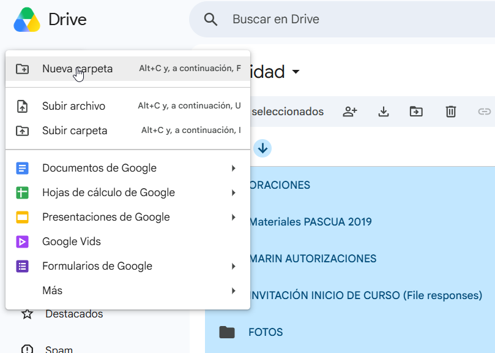
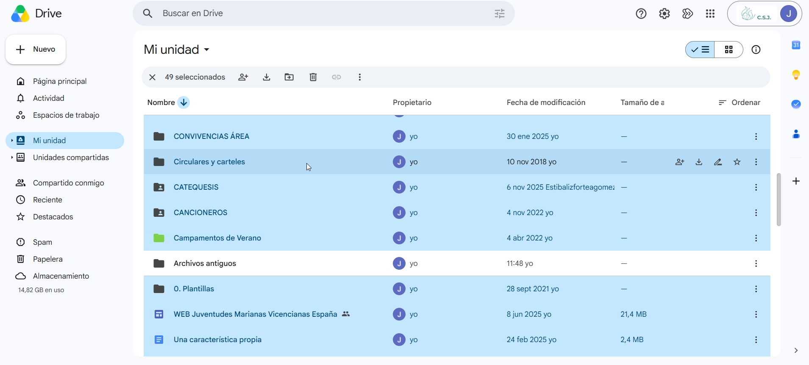
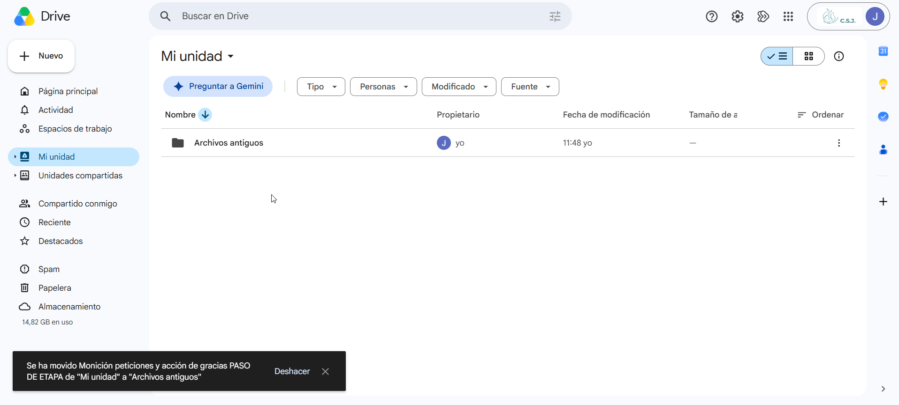
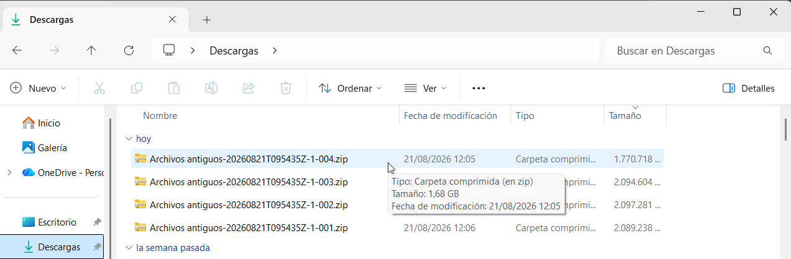
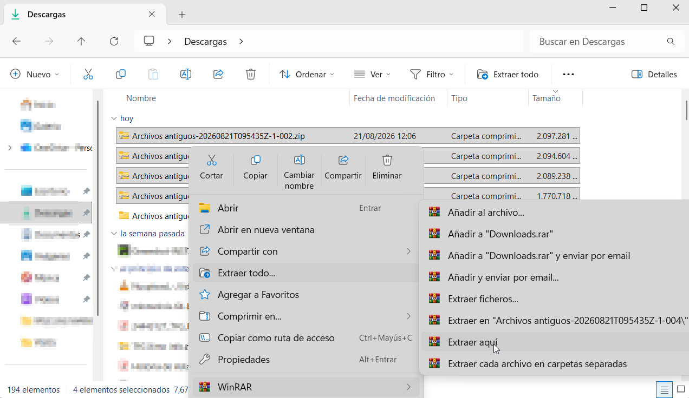
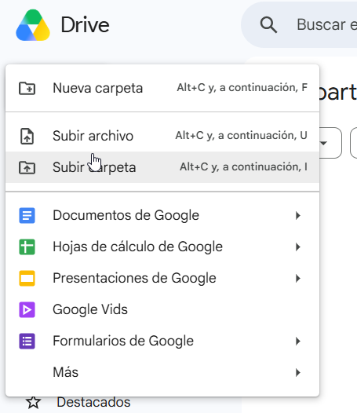
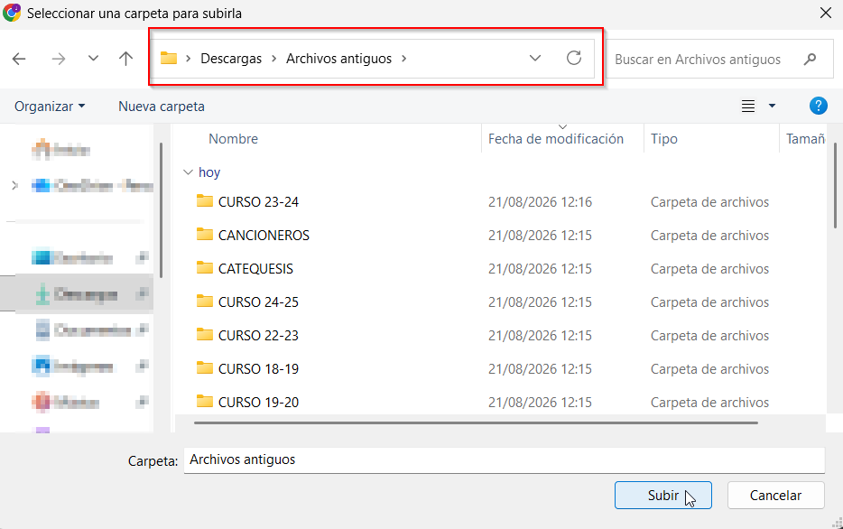

# Migra tu antigua nube al nuevo Drive
> [!danger]
> En el nuevo Drive, almacenaremos datos sensibles en una unidad aparte.&#x20;
>
> Por favor, consulta la política de Unidades Compartidas: [Unidades Comparitdas: qué y para qué](../Corporativo/Políticas/unidades-compartidas.md)

1. Crea una carpeta en tu antiguo Drive con el nombre “Archivos antiguos”.

 

 

2. Selecciona todos los ficheros de “Mi unidad” usando la tecla Ctrl +A (si haces click en la carpeta Archivos antiguos mientras tienes apretado la tecla Ctrl la deseleccionas) y muévelos a la nueva carpeta nueva.

3. Repite el punto anterior hasta que solamente quede la carpeta Archivos Antiguos.

4. Una vez ya no quede ningún archivo por mover, descargamos la carpeta. Dependiendo de la cantidad de archivos que tengamos, este proceso puede tardar unos minutos. Puede que también se descarguen varios archivos .zip para dividir la descarga en paquetes más pequeños.

   
5. Cuando se hayan descargado los ficheros, tendremos que ir a la carpeta donde se han descargado y seleccionarlos. Hacemos click con el botón derecho del ratón y seleccionamos la opción “WinRar” y “Extraer aquí”.
6. 

   Cuando haya finalizado el proceso, aparecerá la carpeta “Archivos antiguos” esa será la que tenemos que seleccionar para subir en la nueva cuenta.
7. 

 

> [!info]
> OPCIONAL.&#x20;
>
> En la carpeta de “Compartido conmigo” en el Drive de vuestra cuenta original, podéis tener ficheros que os interese descargaros para guardarlos. Añadirlos a la carpeta descargada antes de subir esta carpeta a la nueva cuenta corporativa.

> [!warning]
> Consulta la política de uso sobre "Mi Unidad" y las UNIDADES COMPARTIDAS
>
> Toda la info aquí: [Unidades Comparitdas: qué y para qué](../Corporativo/Políticas/unidades-compartidas.md)

 
